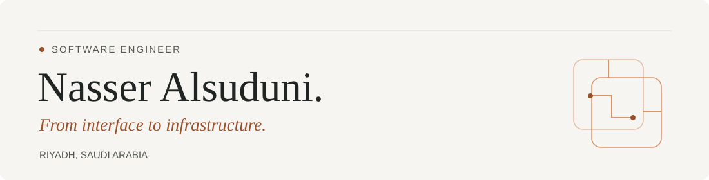

  <b>ASP.NET Core · Angular · Python · Django · React</b>

  <a href="https://nasser-alsuduni.site/">Portfolio</a> &nbsp;·&nbsp;
  <a href="https://www.linkedin.com/in/nasser-alsuduni-7505b5240/">LinkedIn</a> &nbsp;·&nbsp;
  <a href="mailto:Nasser.alsuduni@outlook.sa">Email</a>

## A little about me

I'm Nasser, a **Computer Science graduate** and a software engineer based in **Riyadh, Saudi Arabia**. I trained at **Elm** and **Tuwaiq Academy**, building full-stack applications and contributing to enterprise software.

I enjoy working on both sides of an application: the interface people use and the system behind it. My projects span developer tools, bilingual browser extensions, adaptive learning, and e-commerce, with a focus on maintainable architecture and reliable APIs.

## Selected work

| Project | What I built |
| :--- | :--- |
| **[SPLM](https://github.com/Nasser-Alsuduni0/SPLM_Backend)** [Frontend](https://github.com/Nasser-Alsuduni0/SPLM_Frontend) · [API](https://github.com/Nasser-Alsuduni0/SPLM_Backend) | Project and release lifecycle management with configurable workflows, real-time notifications, and background jobs. **Angular · ASP.NET Core · EF Core · SignalR · RabbitMQ** |
| **[Imlaha / املأها](https://nasser-alsuduni.site/projects/imlaha)** [Chrome Web Store](https://chromewebstore.google.com/detail/imlaha-%D8%A7%D9%85%D9%84%D8%A3%D9%87%D8%A7/ofbngmknmapfdhagmgpondmdfagkfopg) | A bilingual form-filling extension with Arabic / English support, on-device encryption, and field-by-field control. **TypeScript · React · WXT · Web Crypto** |
| **[Imtiaz / امتياز](https://imtiaz.digital/)** [Project overview](https://nasser-alsuduni.site/projects/imtiaz) | Adaptive Saudi GAT preparation with diagnostic assessments, personalized study plans, and spaced repetition. **Angular · ASP.NET Core · Clean Architecture · CQRS** |
| **[Nomo Flow](https://github.com/Nasser-Alsuduni0/Nomo-Flow)** | A marketing toolkit for Salla merchants with live visitor counters, discount coupons, and purchase notifications. **Python · Django · FastAPI · PostgreSQL · Salla API** |
| **[HalaOrder](https://github.com/Nasser-Alsuduni0/HallaOrder)** | A team graduation project at Tuwaiq Academy: multi-tenant restaurant ordering, menus, payments, and role-based dashboards. **Python · Django · PostgreSQL · Multi-tenancy** |
| **[Stocker / Inventory Plus](https://github.com/Nasser-Alsuduni0/Stocker)** | An inventory management system with product and supplier tracking, low-stock and expiry alerts, and CSV import/export. **Python · Django · Inventory Management · Email Alerts** |

More on my portfolio: [Jawaker Games Hub](https://nasser-alsuduni.site/projects/jawaker) and [Ebda’at Al-Sharq](https://nasser-alsuduni.site/projects/ebdaat-alsharq).

## My toolbox

| Area | Technologies |
| :--- | :--- |
| **Languages** | C# · Python · TypeScript · JavaScript |
| **Interfaces** | Angular · React · PrimeNG · Tailwind CSS · SCSS |
| **Backend & data** | ASP.NET Core · Django · FastAPI · EF Core · SQL Server · PostgreSQL |
| **Architecture & messaging** | Clean Architecture · CQRS · REST APIs · JWT / RBAC · SignalR · RabbitMQ · Hangfire |
| **Testing & delivery** | pytest · Unit & integration testing · Docker · GitHub Actions · Git · Postman · Railway · Jira |

---

  Have a project in mind? <a href="mailto:Nasser.alsuduni@outlook.sa">Let's talk</a>. 
  <a href="https://nasser-alsuduni.site/">Explore my portfolio</a> · <a href="https://www.linkedin.com/in/nasser-alsuduni-7505b5240/">Connect on LinkedIn</a>

